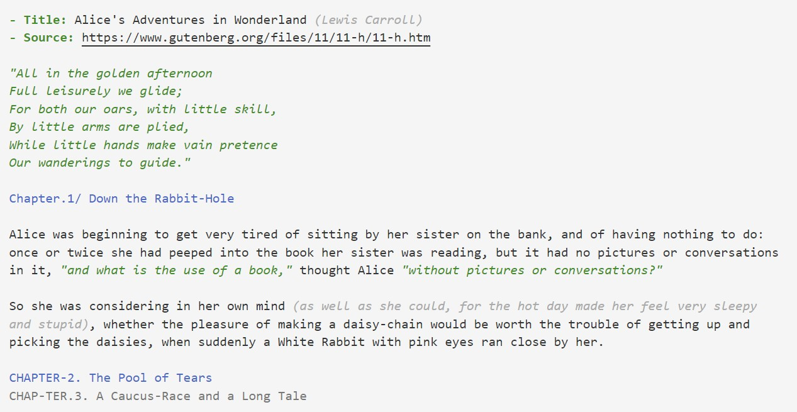

# ColorTXT

Simple vscode extension for raw text highlights.

## Features

Apply colors for various places in text files so that they have a friendly appearance.

- Headers: `<number/text><separator: ., -, or / /><space>`
- Quotes: Texts inside `" "`
- Bracket notes: Texts inside `( )`
- List subjects: Texts between `-` and `:` (at beginning of a new line)

## Requirements

#### dev-dependency
yaml is converted to json using [js-yaml](https://www.npmjs.com/package/js-yaml)

## Release Notes

### 0.0.1